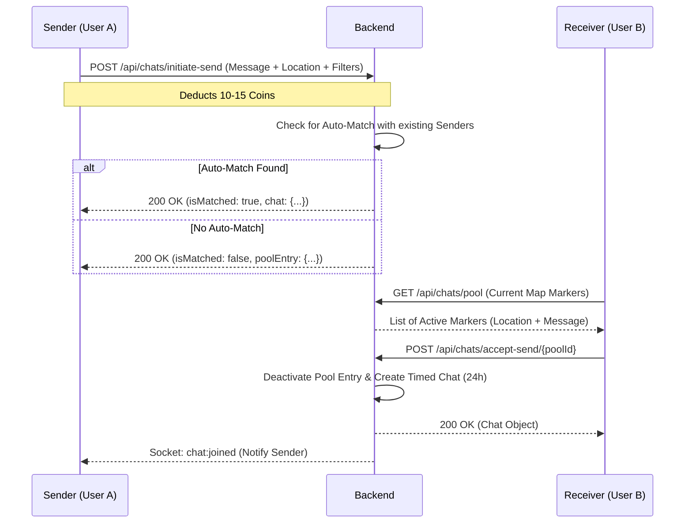
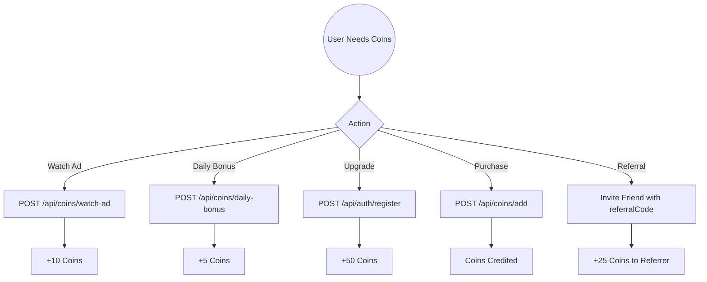

# 📱 Near-By Chat: Flutter Developer Handbook (Phase 1)

Welcome to the Near-By Chat project. This document provides a comprehensive guide for frontend integration, including all API endpoints, Socket.IO events, and the core application flow.

---

## 🗺️ Application Architecture & Flows

### 1. Anonymous Chat Flow (The Map System)
This is the core "dating-style" feature where users can send requests that appear on a global map.

### 2. Coin Economy & Reward Flow

---

## 🔑 Authentication (Silent Login)

Our app uses **Silent Login** to minimize friction. New users are automatically logged in as Guests.

| Method | Endpoint | Description |
| :--- | :--- | :--- |
| `POST` | `/api/auth/guest-login` | Provide `deviceId`. Returns JWT Token and Guest User. |
| `POST` | `/api/auth/register` | Upgrade Guest to Full Account. Add `referralCode` here. |
| `POST` | `/api/auth/login` | Login for permanent users. |
| `GET` | `/api/auth/me` | Get profile, coins, and **your personal `referralCode`**. |

---

## 💬 Chat & Global Pool

### Anonymous Pool (Map Markers)
| Method | Endpoint | Description |
| :--- | :--- | :--- |
| `POST` | `/api/chats/initiate-send` | Put a message on the map. Cost: **10-15 Coins**. |
| `GET` | `/api/chats/pool` | Fetch all active requests (senders) to display on Map. |
| `POST` | `/api/chats/accept-send/{id}` | Accept a request from the pool. Starts a private chat. |
| `POST` | `/api/chats/extend-chat/{id}` | Extend chat by 24h (**50 Coins**) or 48h (**90 Coins**). |

### Regular Messaging
| Method | Endpoint | Description |
| :--- | :--- | :--- |
| `GET` | `/api/chats` | List all active chats for the user. |
| `GET` | `/api/messages/{chatId}` | Get message history for a chat. |
| `POST` | `/api/messages` | Send message via API (Fallback for Sockets). |
| `PUT` | `/api/chats/{id}/clear-unread` | Reset unread badge count. |

---

## 💰 Coin & Reward System

| Method | Endpoint | Description | Reward |
| :--- | :--- | :--- | :--- |
| `POST` | `/api/coins/watch-ad` | Call after Rewarded Ad completes. | **+10 Coins** |
| `POST` | `/api/coins/daily-bonus` | Claim once Every 24 hours. | **+5 Coins** |
| `GET` | `/api/coins/balance` | Get current coin balance & history. | - |
| `GET` | `/api/coins/prices` | Get dynamic prices (extension, filters, etc). | - |

---

## ⚡ Socket.IO Events (Real-time)

**Socket URL:** `http://SERVER_IP:5000`
**Auth:** Pass JWT in `auth: { token: "..." }`

### Incoming (Listen)
*   `message:new`: New message received in a chat.
*   `typing:user`: "User is typing..." status.
*   `user:online` / `user:offline`: Contact status changes.
*   `chat:joined`: Notification when someone accepts your map request.

### Outgoing (Emit)
*   `chat:join`: Must emit `{ chatId }` to receive messages for a room.
*   `message:send`: `{ chatId, content, type }`.
*   `typing:start` / `typing:stop`: Triggered on keyboard input.
*   `location:update`: Update user coordinates in real-time.

---

## 🛠️ Flutter Implementation Tips

### 1. Persistent Storage
Save the `deviceId` and `authToken` using `shared_preferences` or `flutter_secure_storage`. If `authToken` is empty, always call `guest-login` on Splash Screen.

### 2. Time-To-Live (TTL)
Anonymous chats and map markers have a `expiresAt` field. 
- Show a countdown timer in the Chat UI.
- Use `DateTime.parse(expiresAt).isBefore(DateTime.now())` to check expiry.

### 3. Location Permissions
Before calling `/api/chats/initiate-send` or `/api/chats/pool`, ensure you have Location permissions using `geolocator` package.

### 4. Socket.IO Version
Use `socket_io_client: ^2.0.0` or higher to match with the Node.js backend.

---

## 🔴 Error Codes
| Status | Meaning |
| :--- | :--- |
| `401` | Unauthorized (Token expired or missing). |
| `402` | **Payment Required** (Insufficient Coins). Redirect user to "Get Coins" screen. |
| `403` | Forbidden (e.g., trying to access a deleted chat). |
| `422` | Validation Error (Check your body parameters). |
| `429` | Too many requests (Rate limit reached). |
